# BarLauncher-Volume

Change/Set volume from bar launchers applications like Wox or Flow Launcher.

* **Home** : https://github.com/gissehel/BarLauncher-Volume
* **Keyword** : `vol`

# Installation

## For Wox

```
wpm install Change volume
```

## For Flow Launcher

Waiting for submission/approval...

# Usage

```
vol
```

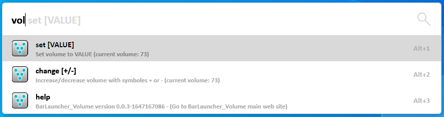

You can see that the current volume is **73**.

Let set it to **41**

```
vol set 41
```

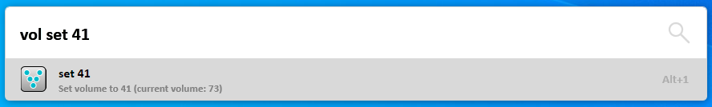

Validate the entry.

The bar disapear and the volume is indeed set to 41.

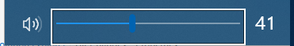

Reopen the bar a try a *change*:

```
vol change 
```


Note that the current volume is **41**.

Type `+`

```
vol change +
```

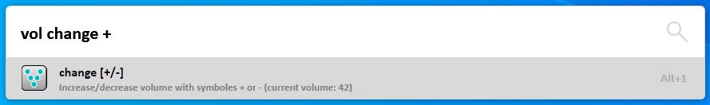

The volume has increased to **42** (even without selecting the item).

You can then continue to add some +/- signs

```
vol change ++
```

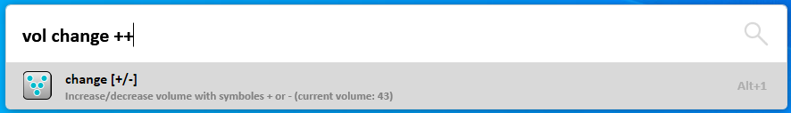

The volume has increased to **43**.

```
vol change +++
```

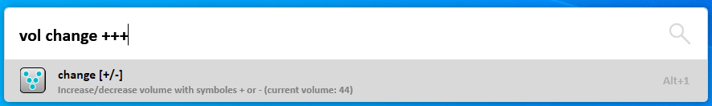

The volume has increased to **44**.

```
vol change ++++
```

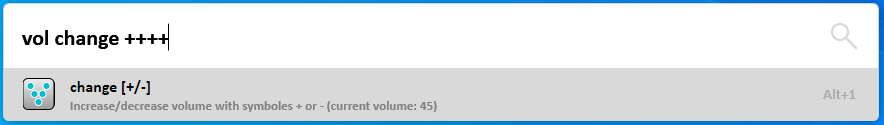

The volume has increased to **45**.

```
vol change +++++
```

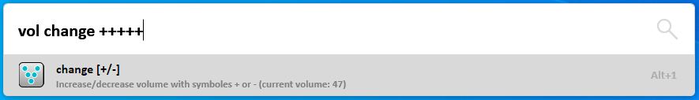

The volume has increased to **47** and not **46**. When you're doing a sequence of the same change, after 4 change "by 1", it starts changing "by 2", "by 3", "by 4" and then all the subsquent changes are "by 5".

```
vol change ++++++
```


The volume has increased to **50** (+3).

```
vol change +++++++
```

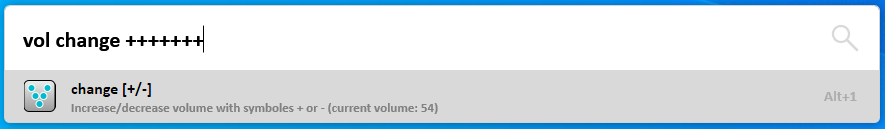

The volume has increased to **54** (+4).

```
vol change ++++++++
```

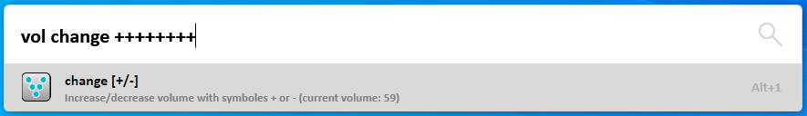

The volume has increased to **59** (+5).

```
vol change +++++++++
```

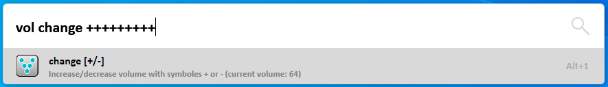

The volume has increased to **64** (+5).

```
vol change ++++++++++
```

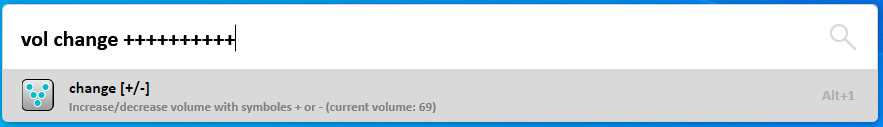

The volume has increased to **69** (+5).


```
vol change ++++++++++-
```

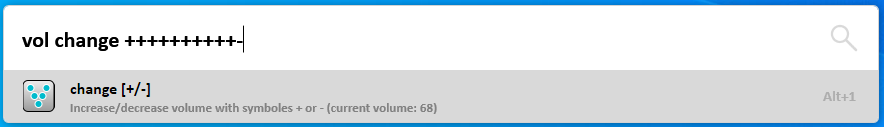

The volume has decreased to **68** (-1).

When the sens change, the step goes back to *1* (increase or decrease).

The change is adaptative.

## Quick usage

The parser will try to guess the best command you want if you don't specify the command's name.

If you type

```
vol 82
```

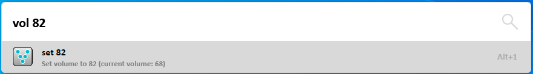

The plugin understand you want to set the volume to 82


If you type 

```
vol +
```

The plugin understand you want to increment the volume, and will automatically rewrite your request to `vol change +`

```
vol change +
```

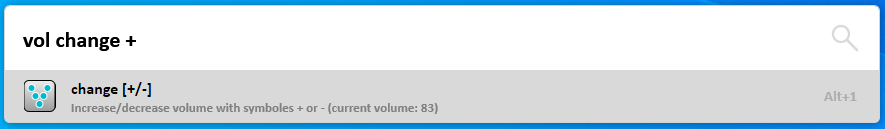


